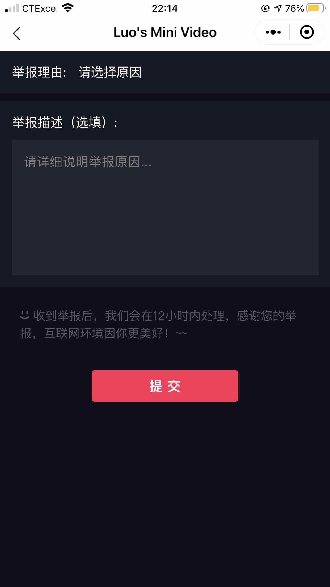
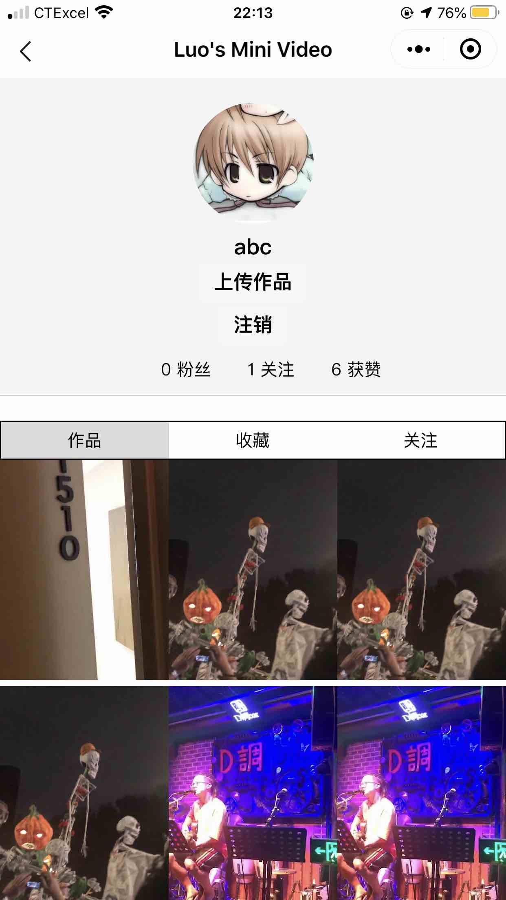
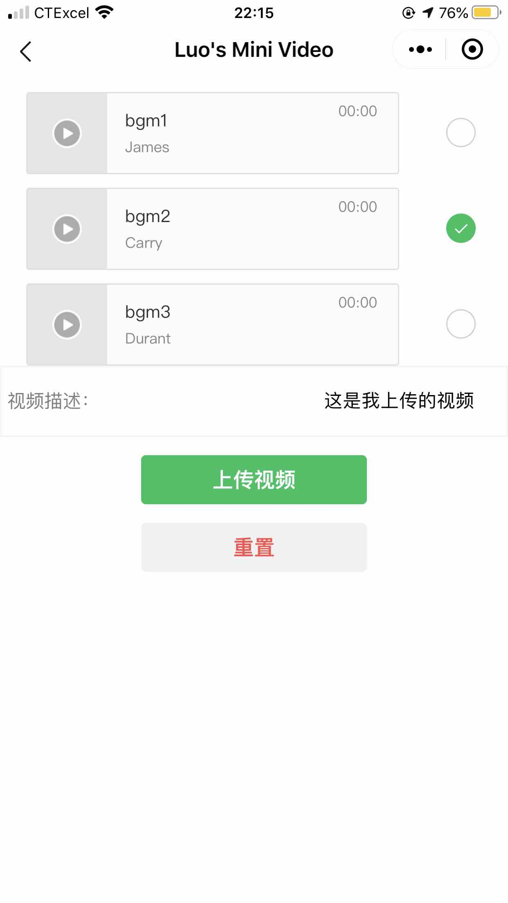

# Video-Share-Platform
This is a WeChat Mini Program developed by Lingwei Luo  

It is a Video Share Platform which is similar to TikTok  

Overview
---------
* Frontend
  * Language: JavaScript + HTML + CSS

* Backend
  * Language: Java
  * Framework: Spring Boot
  * Tools: redis, swagger2, ffmpeg, maven

* Database
  * mysql + mybatis + mybatis-pagehelper

Supported modules
---------
* User related:
  * Regist, Login, Logout  
  * ChangeFace
  * Follow (unfollow) user
  * Report user

* Video related
  * User upload videos
  * User combine video with bgm
  * User like videos
  * User check others' videos
  * User comment on videos
  * User reply to others' comments
  * User repost video to friends
  * User search videos by topic
  * User download video

Program presentation
---------

---------------------------------------------------

<figure class="half">
    
</figure>

---------------------------------------------------

<figure class="half">
    
    
</figure>
<figure class="half">
    
    
</figure>
<figure class="half">
    
    
</figure>
<figure class="half">
    
    
</figure>
<figure class="half">
    
    
</figure>